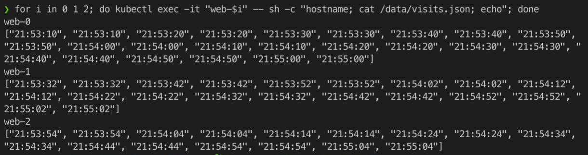

# K8s StatefulSet

### K8s entities

### State of each pod

The output is different because the service forwards request to one of the three running pods. Each pod has its own volume. Note that requests are made to the root path to check health and readiness of a pod.

### Ordering

The ordering is not important for this application because all pods are independent of each other (they do not communicate unlike nodes in distributed systems).