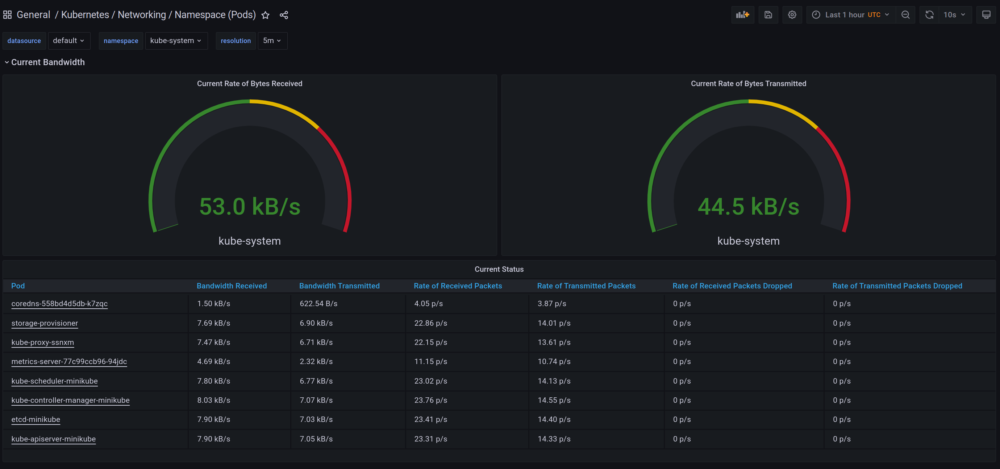

## Kube Prometheus Stack 
### Components
- Prometheus operator - Kubernetes operator for Prometheus. It helps create, configure and manage Prometheus in Kubernetes.
- Prometheus - monitoring application collecting metrics from services.
- Alertmanager - manages alerts sent by Prometheus. It can send notifications to email, chats, Slack etc.
- Prometheus node-exporter - collect OS and hardware related metrics about nodes in Kubernetes cluster.
- Prometheus Adapter for Kubernetes Metrics APIs - convert Kubernetes Metrics API to Prometheus metrics.
- kube-state-metrics - service listening to Kubernetes API and collecting metrics for Prometheus. 
- Grafana - visualization web application. Often used to build graphs and diagrams based on metrics collected by Prometheus.

### Print pods, stateful sets, services, percictent volumes, configmaps

```
❯ kubectl get po,sts,svc,pvc,cm
NAME                                                         READY   STATUS    RESTARTS   AGE
pod/alertmanager-monitoring-kube-prometheus-alertmanager-0   2/2     Running   0          98s
pod/monitoring-grafana-5687c8b9fd-fqhcd                      2/2     Running   0          100s
pod/monitoring-kube-prometheus-operator-769f647f65-vn4pf     1/1     Running   0          100s
pod/monitoring-kube-state-metrics-589766f6cb-9zpwt           1/1     Running   0          100s
pod/monitoring-prometheus-node-exporter-k59db                1/1     Running   0          100s
pod/prometheus-monitoring-kube-prometheus-prometheus-0       2/2     Running   0          98s
pod/web-0                                                    1/1     Running   0          2m46s
pod/web-1                                                    1/1     Running   0          2m46s
pod/web-2                                                    1/1     Running   0          2m46s

NAME                                                                    READY   AGE
statefulset.apps/alertmanager-monitoring-kube-prometheus-alertmanager   1/1     98s
statefulset.apps/prometheus-monitoring-kube-prometheus-prometheus       1/1     98s
statefulset.apps/web                                                    3/3     2m46s

NAME                                              TYPE           CLUSTER-IP       EXTERNAL-IP   PORT(S)                      AGE
service/alertmanager-operated                     ClusterIP      None             <none>        9093/TCP,9094/TCP,9094/UDP   98s
service/kubernetes                                ClusterIP      10.96.0.1        <none>        443/TCP                      53d
service/monitoring-grafana                        ClusterIP      10.106.188.7     <none>        80/TCP                       100s
service/monitoring-kube-prometheus-alertmanager   ClusterIP      10.99.87.132     <none>        9093/TCP                     100s
service/monitoring-kube-prometheus-operator       ClusterIP      10.108.96.43     <none>        443/TCP                      100s
service/monitoring-kube-prometheus-prometheus     ClusterIP      10.100.64.134    <none>        9090/TCP                     100s
service/monitoring-kube-state-metrics             ClusterIP      10.108.72.49     <none>        8080/TCP                     100s
service/monitoring-prometheus-node-exporter       ClusterIP      10.101.214.138   <none>        9100/TCP                     100s
service/prometheus-operated                       ClusterIP      None             <none>        9090/TCP                     98s
service/web                                       LoadBalancer   10.104.35.94     <pending>     8000:32509/TCP               2m46s

NAME                                   STATUS   VOLUME                                     CAPACITY   ACCESS MODES   STORAGECLASS   AGE
persistentvolumeclaim/web-json-web-0   Bound    pvc-bc4dff3f-cd84-4557-8e78-d9d46540210e   64Mi       RWO            standard       18h
persistentvolumeclaim/web-json-web-1   Bound    pvc-149d0377-6bc0-44ff-8a4e-2e0b93b8d44e   64Mi       RWO            standard       18h
persistentvolumeclaim/web-json-web-2   Bound    pvc-951b05cc-9337-4d56-86f2-e5a0954cd2c7   64Mi       RWO            standard       18h

NAME                                                                     DATA   AGE
configmap/kube-root-ca.crt                                               1      53d
configmap/monitoring-grafana                                             1      100s
configmap/monitoring-grafana-config-dashboards                           1      100s
configmap/monitoring-grafana-test                                        1      100s
configmap/monitoring-kube-prometheus-alertmanager-overview               1      100s
configmap/monitoring-kube-prometheus-apiserver                           1      100s
configmap/monitoring-kube-prometheus-cluster-total                       1      100s
configmap/monitoring-kube-prometheus-controller-manager                  1      100s
configmap/monitoring-kube-prometheus-etcd                                1      100s
configmap/monitoring-kube-prometheus-grafana-datasource                  1      100s
configmap/monitoring-kube-prometheus-k8s-coredns                         1      100s
configmap/monitoring-kube-prometheus-k8s-resources-cluster               1      100s
configmap/monitoring-kube-prometheus-k8s-resources-namespace             1      100s
configmap/monitoring-kube-prometheus-k8s-resources-node                  1      100s
configmap/monitoring-kube-prometheus-k8s-resources-pod                   1      100s
configmap/monitoring-kube-prometheus-k8s-resources-workload              1      100s
configmap/monitoring-kube-prometheus-k8s-resources-workloads-namespace   1      100s
configmap/monitoring-kube-prometheus-kubelet                             1      100s
configmap/monitoring-kube-prometheus-namespace-by-pod                    1      100s
configmap/monitoring-kube-prometheus-namespace-by-workload               1      100s
configmap/monitoring-kube-prometheus-node-cluster-rsrc-use               1      100s
configmap/monitoring-kube-prometheus-node-rsrc-use                       1      100s
configmap/monitoring-kube-prometheus-nodes                               1      100s
configmap/monitoring-kube-prometheus-persistentvolumesusage              1      100s
configmap/monitoring-kube-prometheus-pod-total                           1      100s
configmap/monitoring-kube-prometheus-prometheus                          1      100s
configmap/monitoring-kube-prometheus-proxy                               1      100s
configmap/monitoring-kube-prometheus-scheduler                           1      100s
configmap/monitoring-kube-prometheus-statefulset                         1      100s
configmap/monitoring-kube-prometheus-workload-total                      1      100s
configmap/prometheus-monitoring-kube-prometheus-prometheus-rulefiles-0   28     98s
```

## Monitoring
1. Check how much CPU and Memory your StatefulSet is consuming.


2. Check which Pod is using CPU more than others and which is less in the default namespace.


3. Check how much memory is used on your node, in % and mb.


4. Check how many pods and containers actually ran by the Kubelet service.


5. Check which Pod is using network more than others and which is less in the default namespace.



6. Check how many alerts you have.


## Init containers
